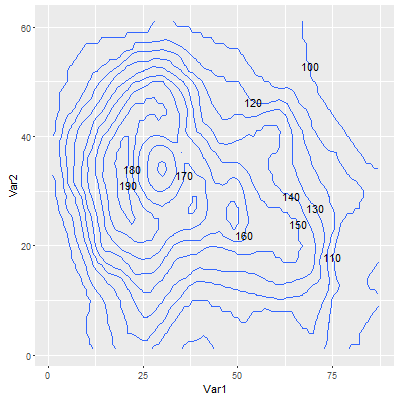

gglabeledcontour
===================

`geom_contour()` with labels.

**NOTE: This package uses ggproto, which will be available in ggplot2 ver1.1.0; You have to `install_github("hadley/ggplot2")` until the day will come.**

## Usage

```r
library(gglabeledcontour)

v3d <- reshape2::melt(volcano)
ggplot(v3d, aes(Var1, Var2, z = value)) +
  geom_labeled_contour()
```



## Installation

```r
devtools::install_github("yutannihilation/gglabeledcontour")
```

## What is ggproto?

See [https://github.com/hadley/ggplot2/blob/master/vignettes/extending-ggplot2.Rmd].
